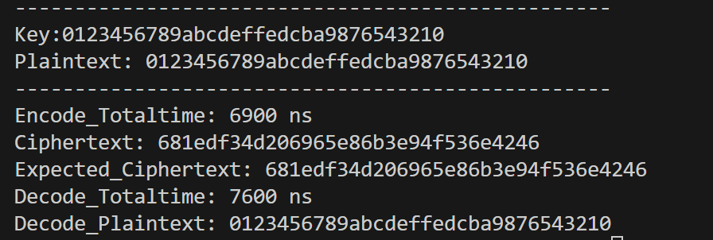
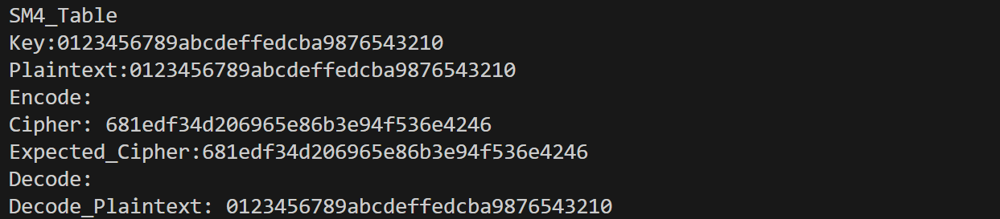
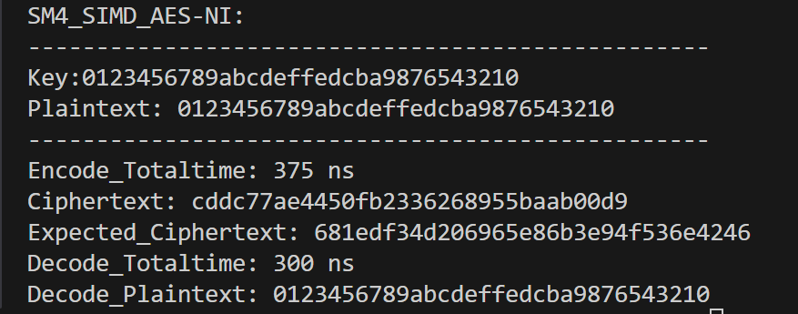
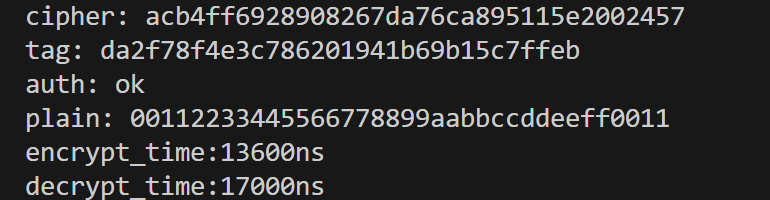

# 实验一报告

## 实验目标
- 基于 SM4 的标准实现，完成多种软件优化：
  - 实现高性能SM4密码算法
  - 多层次优化策略（T-table、AES-NI、现代指令集）
  - SM4-GCM认证加密模式实现

## 实验原理
### SM4 分组密码简述
- 分组大小 128 比特，密钥 128 比特，32 轮迭代。
- 每轮包含：T 变换（S 盒字节替换 + 线性变换 L）与轮密钥加。
- 关键变换：
  - S 盒为 8 位输入输出的固定置换。
  - 线性变换 L：对 S 盒输出做多次循环左移并异或（2/10/18/24 位）。
  - 密钥扩展：使用 T' 变换（13/23 位移）和系统参数 FK/CK 产生 32 个轮密钥。

### 软件优化思路
- T-table：T-table优化将S-box查找和线性变换合并，减少运算次数。将一个8×8的S-box扩展为四个8×32的查找表
- 指令集优化：
  - AES-NI 同构映射：利用AES-NI指令集加速SM4运算，通过等价变换将SM4的S-box操作映射到AES指令。
  - SIMD 多块并行：同时处理 4×128bit 块，提升吞吐。

### GCM 工作模式原理
- GCM = CTR 流水加密 + GHASH 认证。
- CTR：对 `J0+1, J0+2, ...` 做分组加密得到密钥流，与明文异或产生密文；计数器采用 32 位大端自增（inc32）。
- GHASH：在 GF(2^128) 上对 AAD 与密文进行多项式累乘求和：
  - 子密钥 `H = E_K(0^128)`。
  - 认证值 `S = GHASH_H(AAD || C || len(AAD)||len(C))`。
  - 标签 `Tag = E_K(J0) XOR S`。
- IV 处理：
  - 若 IV 长度为 12 字节，`J0 = IV || 0x00000001`；
  - 否则 `J0 = GHASH_H(IV || pad || 64-bit(0) || 64-bit(len(IV)bits))`。

## 实验过程
### SM4实现（`main.cpp`）
- 按标准实现 S 盒、FK/CK、T/T' 变换、轮密钥生成与 32 轮加解密。
- 使用国家标准测试向量验证：
  - Key/Plain: `0123456789abcdeffedcba9876543210`
  - Cipher: `681edf34d206965e86b3e94f536e4246`

### T-table 实现（`sm4_table.cpp`）
- T-table优化效果：
- 减少每轮4次旋转操作，提升约40-60%的性能，增加4KB内存占用

### AES-NI实现（`sm4_AESNI.cpp`）
- 通过同构映射把 SM4 S 盒转到 AES 域，调用 `_mm_aesenclast_si128`，再映回；
- 使用 `_mm_shuffle_epi8` 做字节打散/重排；
- 4 块并行+循环展开，减少轮间开销；
- 计时用 `std::chrono`，展示单位开销；
- 该路径在支持 AES-NI 的 x86 平台有明显吞吐优势。

### SM4-GCM（`SM4_GCM`）
- 关键细节：
  - 复用标量 SM4 加密单块作为 CTR 与生成 H；
  - GHASH 使用二进制多项式乘法（不可约多项式 `x^128 + x^7 + x^2 + x + 1`），当前实现为位串算法；
  - 计数器 `inc32` 以大端自增末 32 位；
  - Tag 常数时间比较，认证失败不输出明文。

## 实验结果
### SM4运行结果

### SM4查表运行结果

### SM4_AES_NI运行结果

### SM4_GCM运行结果

